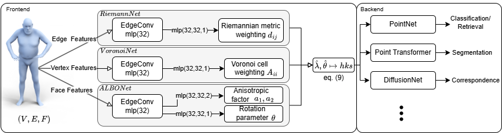

# LBONet: Supervised Spectral Descriptors for Shape Analysis



**Authors**: [Oguzhan Yigit](https://www.cs.york.ac.uk/people/?group=cvpr&username=oguzhan) and [Richard C. Wilson](https://sites.google.com/york.ac.uk/richard-wilson/home)  
**GitHub**: [yioguz/LBONet](https://github.com/yioguz/LBONet)  
**Paper**: [arXiv:2411.08272](https://arxiv.org/abs/2411.08272)

LBONet is a PyTorch-based framework that learns task-specific modifications to the Laplace–Beltrami operator (LBO) for intrinsic shape analysis on 3D surfaces and meshes. It adapts the LBO eigenbasis to improve performance across various geometric learning tasks.

---

## 🧠 Overview

LBONet modifies the eigenbasis of the Laplace–Beltrami operator by learning geometric parameters over mesh elements. This improves spectral descriptors for tasks such as:

- Shape retrieval and classification  
- Shape segmentation  
- Dense shape correspondence  

It introduces **learnable modules** that deform the geometry and local operators to steer the spectral embedding.

---

## 🔧 Key Modules

- **RiemannNet** – learns edge-based metric weights (affects stiffness matrix)  
- **ALBONet / ALBO+Net** – learns anisotropic weights and directions on faces  
- **VoronoiNet** – learns vertex-based area weights (affects mass matrix)

These are combined to solve a modified LBO eigenproblem in a **differentiable** and **task-driven** way.

---

## 🔍 Features

- ✅ Differentiable eigendecomposition (custom CPU-based solver with PyTorch autograd)
- ✅ Modular architecture (easy to plug in new geometry learners)
- ✅ Supports classical and neural descriptor backends (e.g. DiffusionNet, Pointnet++, etc.)
- ✅ Efficient sparse matrix operations
- ✅ Strong performance on non-rigid shape benchmarks

---

## 📊 Benchmarks

LBONet achieves state-of-the-art or competitive results on:

- **SHREC’11/14/15/ShapeNetCore55** – classification and retrieval  
- **FAUST** – dense correspondence  
- **COSEG / Human Segmentation / ShapeNet Part** – segmentation  

Includes detailed ablation studies showing the effect of each module.

---

## 🧪 Example Forward Pass

Below is a code snippet demonstrating how LBONet can be integrated into another architecture—in this case, a PointNet++-style network—for various downstream tasks. Unlike traditional approaches that use fixed HKS descriptors, LBONet learns task-driven HKS embeddings, adapting the spectral representation to the specific objective.

```python
def forward(self, vertices, faces, edges, feature_vector, feature_vectorP, feature_vectorf, el, ts,
            corners, minCurvature, maxCurvature, rotationNormal, cats):

    hks = self.LBONetImplicit(vertices, faces, edges, feature_vector, feature_vectorP,
                              feature_vectorf, el, ts, corners, minCurvature, maxCurvature, rotationNormal,
                              cats)

    B, C, N = vertices.shape

    l0_points = hks
    l0_xyz = vertices.float().cuda()
    l1_xyz, l1_points = self.sa1(l0_xyz, l0_points)
    l2_xyz, l2_points = self.sa2(l1_xyz, l1_points)
    l3_xyz, l3_points = self.sa3(l2_xyz, l2_points)
    # Feature Propagation layers
    l2_points = self.fp3(l2_xyz, l3_xyz, l2_points, l3_points)
    l1_points = self.fp2(l1_xyz, l2_xyz, l1_points, l2_points)
    cls_label_one_hot = cats.view(B, 16, 1).repeat(1, 1, N)
    l0_points = self.fp1(l0_xyz, l1_xyz, torch.cat([cls_label_one_hot, l0_xyz, l0_points], 1), l1_points)
    feat = F.relu(self.bn1(self.conv1(l0_points)))
    x = self.drop1(feat)
    x = self.conv2(x)
    x = F.log_softmax(x, dim=1)

    return x
```
where the layer is initialized with

```python
self.LBONetImplicit = LBONet.layers.LBONetImplicit(16, 16, 16)
```

and the numbers control the width of RiemannNet, ALBO+Net, and VoronoiNet.


## 📄 License

This repository is licensed under the **CC BY-NC-SA 4.0 License**.  
See the full license [here](https://creativecommons.org/licenses/by-nc-sa/4.0/).